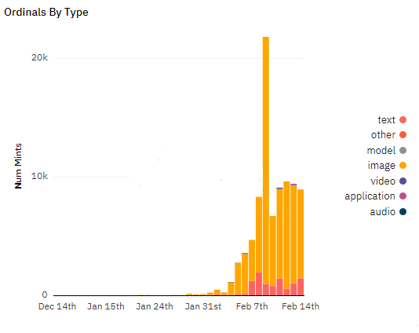
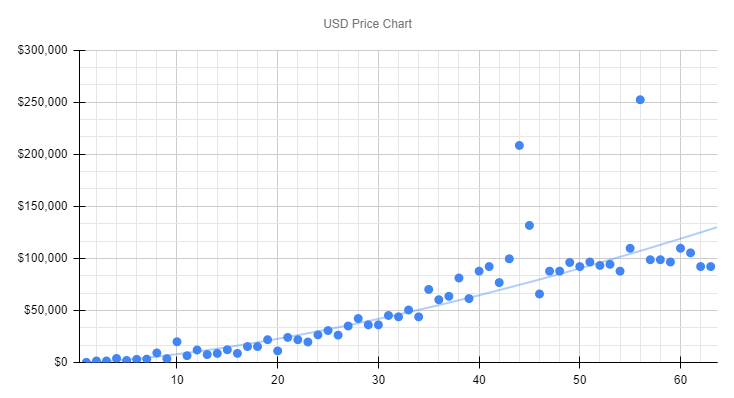
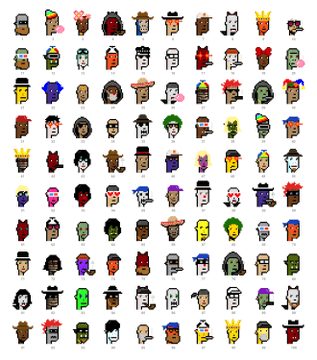
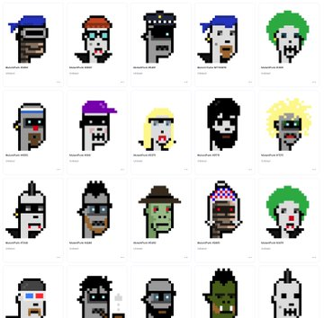
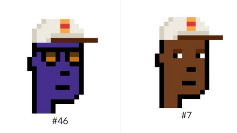
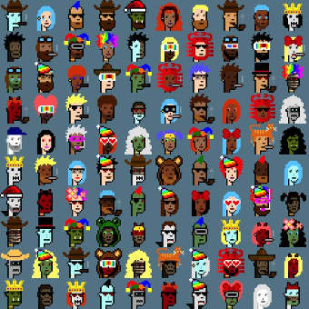
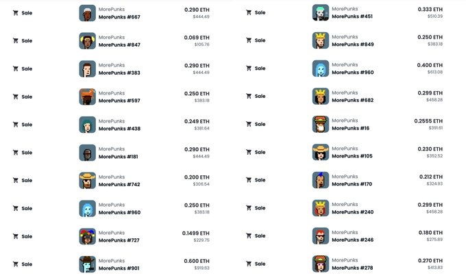

# Awesome 100 Ordinal Punks (Anno 2023) Notes - 24×24 Pixel Art on the (Bitcoin) Blockchain

All about the 100 pixel punks inscribed on the bitcoin (classic) blockchain in the (binary) image/png format - 8-bit colors (in r/g/b with alpha channel); 24×24 with 8x zoom, that is, 192×192 pixels.


**Official**

web: [ordinalpunks.com](https://ordinalpunks.com),
twitter:  [@OrdinalPunks](https://twitter.com/OrdinalPunks)


> Ordinal punks are a generative profile picture (PFP) collection
> that is fully on-chain on the bitcoin blockchain
> minted within the first 650 inscriptions.
>
> Ordinal Punks are using an [open source algorithm](https://github.com/cryptopunksnotdead/cryptopunks/tree/master/cryptopunks) to generate the profile picture (pfp) which is 192x192 pixels [24x24 with 8x zoom].


**Unofficial**

- ordinals directory: [ordinal-punks](https://ordinalsdirectory.com/ordinal-punks/)


Q: Who is the creator?

Flow Stay is the creator of Ordinal Punks.

Q: Who is Flow Stay?

Flow Stay is the anonymous discord (chat) handle
of the Ordinal Punks creator
and likely the creator of the official website
and twitter page & posts.

As of February 14th, 2023 Flow Stay is still posting
(and hasn't yet disappeared Sathosi-like forever).

If you know more, please tell / share!


Q: How are punk (pixel art) images generated?

Note / Disclaimer:  I (Gerald Bauer) am the creator of the punk's not dead text-to-image generation algorithm  (& [punk spritesheet](https://github.com/cryptopunksnotdead/punks.spritesheet)) BUT
have heard about Ordinal Punks in the news and
I have no insight knowledge and
I am NOT affiliated with Ordinal Punks (HODLing: 0).


Anyways,
to give you an idea on how-to-use
the punk (open source) algorithm / machinery
I have put together [**100 Ordinal Punks - The Free White Label Quick Starter Edition**](../ordinalpunks) - Yes, you can. Let's (re)create from zero / scratch a pixel-perfect
copy of the Ordinal Punks collection (Anno 2023) using text prompts ("attributes").


**More**

- [Top Selling Ordinal Punks (on Bitcoin) Powered / Generated By (Crypto) Punk's Not Dead](https://old.reddit.com/r/CryptoPunksDev/comments/10y16ag/top_selling_ordinal_punks_on_bitcoin_powered/)
- [Are Ordinal Punks (On Bitcon) Originals? Or A Copy Of Copy Of Copy? Hint: I Am the Creator of the "Sooper Sekretoo" Punk (Image Generation) Spritesheet. Questions (& Comments) Welcome ;-)](https://old.reddit.com/r/CryptoPunksDev/comments/10yvah9/are_ordinal_punks_on_bitcon_originals_or_a_copy/)


## Timeline

**2022**

December

- December 14th -- Genesis of Ordinals (on Bitcoin); [First Inscription @ #0](https://ordinals.com/inscription/6fb976ab49dcec017f1e201e84395983204ae1a7c2abf7ced0a85d692e442799i0) - 1-Bit Black& White (Pixel Art) Skull

**2023**

January

-   Flow Stay starts discord (chat) channel and announces Ordinal Punks

-  January 31st -- [Ordinal Punks](https://twitter.com/OrdinalPunks/status/1620230583711576068) writes:
   > Going to be launching in a couple hours.
   > Come join the discord. We will be giving away two free mints.


February

- February 1st @ 10:17:24 -- [First Inscription @ #537](https://ordinals.com/inscription/96d87d7e59d75ebc0e6144b09fdd96355fcdaa86fd098d64c46f19a424012bbei0) (Ordinal Punk #1) by Flow Stay
    >  From the discord minted-punks channel:
    >  -  Punk 1 given away to @drastics
    >  -  Punk 2 won by @RiskyBiscuit
    >  -  Punk 3 minted by @Skinned
    >  -  Punk 4 minted by @Skinned
    >  -  Punk 5 minted by @Skinned
    >  -  Punk 6 minted by @Skinned
    >  -  Punk 7 minted by @Skinned
    >  -  Punk 8 minted by @Skinned
    >  -  Punk 9 minted by @Skinned
    >  -  Punk 10 minted by @Skinned
    >  -  Punk 11 minted by @Skinned
    >  -  Punk 12 minted by @Skinned
    >  -  Punk 13 minted by @s0up
    >  -  Punk 14 minted by @jokie
    >  - ...

- February 1st -- [Ordinal Punks](https://twitter.com/OrdinalPunks/status/1620605393083990018) writes:
   > Soon ordinal punks will make up 10%
   > of all inscriptions on bitcoin.

- February 1st @ 19:27:27 -- [Last Inscription @ #642](https://ordinals.com/inscription/0cc4000a34b8549afd96b48b78a0d491c541618b2b1f2e0364a48f2d9cccc8cei0) (Ordinal Punk #100)  by Flow Stay
    > From the discord minted-punks channel (continued):
    > - ...
    > -  Punk 94 minted by @NFTier
    > -  Punk 95 minted by @Mrmorgo
    > -  Punk 96 minted by @CollectorKev
    > -  Punk 97 minted by @Ares
    > -  Punk 98 minted by @Crabby
    > -  Punk 99 Minted by @RoyalOrdinal
    > -  Punk 100 minted by @jasonrosenstein
    > - All punks have been minted onchain now

- February 2nd  -- [Ordinal Punks](https://twitter.com/OrdinalPunks/status/1620977031575113729) writes:
    > We are officially sold out. Our mint was oversubscribed
    > by nearly 4x. Congrats to all the minters.


- February 5th  -- [Ordinal Punks](https://twitter.com/OrdinalPunks/status/1622087164140949504) writes:
    > There was a point in time when Ordinal Punks were 15%
    > of all inscriptions on bitcoin.
    > Now we just broke 3500 inscriptions (2.85%) on bitcoin. Things are moving quickly
    >
    >> Inscriptions go brrrrr.
    >>
    >> o
    >>
    >> And five days later closing the 50 000 mark...


- February 8th  -- [Director of Research @ Proof Collective](https://twitter.com/punk9059/status/1623411865597407233) writes:
    > Bids and asks are happening on Google Docs for Ordinal Punks.
    >  Floor (ask) appears to be 55.4 ETH right now. Bids at 40.2 ETH.
    >
    >> Pricing BTC ordinals in ETH. LOL.
    >>
    >> o
    >>
    >> Blockchain minimalists using spreadsheets? LOL.
    >>
    >> o
    >>
    >> Pretty punk rock way to trade punks.

- February 10th  -- [Tropo Farmer](https://twitter.com/tropoFarmer/status/1624101314664837123) writes:
    > Ordinal Punks  have flipped Matt & John's® Punks V2
    > [as the collection with the highest minimum floor price].
    >
    > Disclosure:  [HODLing] 1 [Ordinal Punk ]
    >
    >> Bro is that a spreadsheet?!?
    >
    > We're early.
    >
    >> You're aware these are asks right?
    >
    > That's what "floor" is.
    >
    >> It's a scam dude. LOL.
- February 11th @ 21:39:00  -- [Metadata Inscription @ #58665](https://ordinals.com/inscription/d026ac5994f698dba475681359b6c29d6d39a895484b95e06b7ae49921d80df2i0) by Tropo Farmer
- February 14th -- 75 000+ Ordinal Inscriptions
     >
     > 


<!--
 Most inscriptions on Feb 9th - 20848 images, 965 text, ...
-->


## Metadata

From the official google docs:

**Punk By Race** - Total 100
- Zombie Ape 1
- Alien Ape 2
- Ape 3
- Skeleton 3
- Mummy 4
- Robot 4
- Orc 5
- Vampire 5
- Alien 6
- Zombie 6
- Demon 7
- Human 54

**Ape Type (By Skin Tone)**
- Blue 1
- Brown 1
- Yellow 1

**Alien Type (By Skin Tone)**
- Green 1
- Pink 1
- Purple 1
- Yellow 1
- Gold 2


**Human Type (By Skin Tone)**
- Yellow ( Punk #98) 1
- Purple (Magenta) 1
- Gold 2
- Blue (Indigo) 4
- Orange 5
- 1 (Dark) 11
- 2 (Medium) 10
- 3 (Light) 9
- 4 (Albino) 11


> [Ordinal Punks] Metadata on-chain forever. Thanks to the help of Tropo Farmer.
>
>  -- [Ordinal Punks, February 11th, 2023](https://twitter.com/OrdinalPunks/status/1624524163011469313)

metadata:  [@ inscription #58665](https://ordinals.com/content/d026ac5994f698dba475681359b6c29d6d39a895484b95e06b7ae49921d80df2i0)


Tropo Farmer writes in "[Bringing collections to Ordinals through metadata, a thread](https://twitter.com/tropoFarmer/status/1624528735700385792)":

> Because Bitcoin has no contracts,
> and therefore no "container" to relate tokens with one another,
> I wanted to help create a standard for establishing
> the provenance of a collection and its items.
> One way we can do that is with a manifest file.
>
> For Ordinal Punks, I created the manifest JSON @ https://ordinals.com/inscription/d026ac5994f698dba475681359b6c29d6d39a895484b95e06b7ae49921d80df2i0,
> which includes info about the collection itself
> (name/desc/supply/inscription dates),
> followed by a detailed enumeration of the items contained within it.
>
> Each item has the things you'd expect on a typical OpenSea page -
> the name, the attributes, and its ID# within the collection.
> We also include the inscription ID, which is the immutable identifier
> for that ordinal. You can paste this value
> into http://ordinals.com for detail.
>
> Also included is an MD5 image hash, for further provenance
> of the ordinal's binary data itself. You can save this image
> of my Ord Punk and match its MD5 checksum
> to the manifest detail for #85, for example.
>
> This manifest file is then validated and permanently inscribed on
> Bitcoin, acting as the source of truth for the collection and the items
> within it, for all of eternity.
>
> I'd love to get feedback on the structure and contents
> of this manifest. I think it's super important for projects
> to inscribe their collection information -
> not only for historical purposes but to deter scamming
> with fraudulent inscriptions.
>
>
>> Q: What happens when someone sells/transfers a ordinal [token]?
>> Does this manifest get updated manually somehow?
>
> A: The manifest doesn't track ownership -
> the ordinal itself will show the address that currently owns it
> (which is related via the inscription ID).


Triva / Errata:   While preparing [**100 Ordinal Punks - The Free White Label Quick Starter Edition**](../ordinalpunks/)
I found two bugs / errors in the official metadata:

-  Ordinal Punk #25  - Incl. An Extra Hoodie
    >     "attributes": [{"trait_type": "Type",   "value": "Male 2"},
    >                    {"trait_type": "Hair",   "value": "Sombrero"},
    >                    {"trait_type": "Mouth",  "value": "Mustache"},
    >                    {"trait_type": "Clothes","value": "Hoodie"}]
-  Ordinal Punk #84  - The (Punk) Type Reads:  Alien Male Green BUT is really (Human) Male 1
    >     "attributes": [{"trait_type": "Type", "value": "Male Alien Green"},
    >                    {"trait_type": "Eyes", "value": "Eye Mask"},
    >                    {"trait_type": "Mouth","value": "Chinstrap"},
    >                    {"trait_type": "Hair", "value": "Fedora Black & White"}]


Bonus:  For your convenience I have reformated
the dataset in javascript notation (.json)
into the tabular dataset in the comma-separated values (.csv) format.
The [**ordinalpunks.csv**](../ordinalpunks/ordinalpunks.csv) dataset (with 100 records / rows) reads:

``` csv
id,  type,  gender, skin_tone,  count, accessories
1,  Robot,   Male,,       1,  Big Beard
2,  Human,   Male,    2,  2,  Bubble Gum / Birthday Hat
3,  Human,   Female,  1,  3,  Flowers / Frown / Gold Chain
4,  Demon,   Male,,       2,  Hoodie / Pipe
5,  Ape,     Male, Blue,  2,  Buck Teeth / Cowboy Hat
6,  Human,   Male,    3,  2,  Laser Eyes / Cowboy Hat B & W
7,  Human,   Male,    1,  1,  Cap Burger King
8,  Vampire, Male,,       1,  Demon Horns
9,  Human,   Female,  Orange,  1,  Crown
...
```


## Pixel Art / Images

You can download - right-click & save ;-) or `git clone` - all 100 ordinal punks one by one (downsampled
to the original 24×24px format) with transparent background
at the [Ordinal Sandbox (& Cache)](https://github.com/pixelartexchange/ordinals.sandbox) at the Pixel Art Exchange.


## Market / Trading Data


official market data (order book) @ google docs: [Ordinal's Punk Data](https://docs.google.com/spreadsheets/d/1_a690MxZUFGMnvU8VkchH1wLUxUQKdTbJpF9geBpHqI/edit)


Example - Bids & Asks on Feburary 12th, 2023:


| BIDS     |     |      |     | ASKS |    |     |    |
|---------|-----|------|-----|------|----|-----|-----|
|Username | BTC | ETH  | USD | USD | ETH | BTC | Punk and Username |
|beautifulnfts.eth | 4 | 57.17 | $87,760 | $107,506 | 70.04 | 4.9 |  Punk 19 / Lib#3138 |
|dennis | 3.85 | 55.03 | $84,469 | $109,700 | 71.47 | 5 |  Punk 13 / s0up#2482 |
|beezy | 3.80 | 54.31 | $83,372 | $131,640 | 85.76 | 6 |  Punk 64 / jayefunk#2417 |
|Shiba_Inu_Tax | 3.51 | 50.17 | $77,009 | $131,640 | 85.76 | 6 |  Punk 49 / PattiHauseman#0001 |
|lmontealegre | 3.504 | 50.08 | $76,878 | $151,123 | 98.45 | 6.888 |  Punk 31 / 888bit#8888 |
|PapiMaxi | 3.5 | 50.03 | $76,790 | $151,386 | 98.62 | 6.9 |  Punk 39 / quantized#9334 |
|pepe_crypto435 | 3.5 | 50.03 | $76,790 | $152,307 | 99.22 | 6.942 |  Punk 45 / tnols#1970 |
| ... |


USD  Sales Chart of the First 63 Sales (From Feb/1st to Feb/12th, 2023)



Note: Sale #1 is mint price to make charts look better -
BTC 0.010 - about US$ 219 / ETH 0.143

Or in totals: 62 sales - BTC 158.388 - about US$ 3,475,031 / ETH 2263.864


> The [oridinal punk] floor [minimum] price has risen to 2.2 bitcoin (about $50 000)
> with a new all-time-high (ATH)
> sale of 9.5 bitcoin (about $215 000) today [for  Punk 94].  -- Feb 9th, 2023

o


[Dingaling](https://twitter.com/dingalingts/status/1623374457791455233) comments:

> Just acquired these seven ordinal punks
> for a total of 15.2 bitcoin (211 ETH)
>
>  Punk 27 (inscription #444),
>  Punk 48 (ins #483),
>  Punk 73 (ins #599),
>  Punk 80 (ins #606),
>  Punk 88 (ins #614),
>  Punk 91 (ins #617),
>  Punk 92 (ins #618),
>
> If you haven't looked into ordinal unique tokens on bitcoin classic (BTC) yet, you should, now.
>
> There's real moment behind ordinals and things are still very very early.
> There are opportunities everywhere.
>
> Orderbooks are currently updated on shared spreadsheets
> and sales are only done via over-the-counter (OTC)/escrow.
>
> But there's lots of building being done behind the scenes...  [..]
> Please do your own research everyone. Many of these will likely go to zero.


o


[Director of Research @ Proof Collective](https://twitter.com/punk9059/status/1624180122793177088) comments:

> Nice little 164 ETH (11.5 BTC)  ordinal punk [no. 41] sale.
> New all-time high (ATH).
>
>> Love to see it, though I do think Ethereum
>> is a better ledger than Google Sheets.
>
> Chart making capabilities far inferior.
>
>>  Come'on those are wash trades.
>>
>> o
>>
>> Crown doesn't even fit right [on the mummy].


**Ordinal Punks Sales Bot**

> Greetings, I am the Ordinal Punks Sales Bot,
who announces Ordinal Punk over-the-counter (OTC) sales!
>
> -- [Ordinal Punk Sale[s Bot]](https://twitter.com/OrdinalPunkSale)


February 12th, 2023:
- Confirmed sale on  Punk #84 for 4.2 BTC
- Confirmed sale on  Punk #77 for 4.2 BTC
- Confirmed sale on  Punk #87 for 4.8 BTC
- Confirmed sale on  Punk #30 for 5 BTC
- Confirmed sale on  Punk #79 for 4.4 BTC
- ...


## Art Critique Corner -  Original? or Copy (of Copy of Copy)? or Derivative (of Derivative of Derivative)?


[Sean Bonner](https://twitter.com/seanbonner/status/1623570699380981762)  comments:

> Ordinal Punks are 100 derivatives which use unthoughtfully applied traits from several other deriv collections, it was done just to do it fast. Nothing about them is interesting to me.
> [...]
> If you want to spend real money on a punk I'd point you to
> Matt & John's® Punk V1 or  V2  [Disclosure: I am HODLing Matt & John's® Punks V1 & V2!]
>
>  o
>
> This is the first punk on bitcoin ordinals. Inscription #89. The narrative that a 100 piece collection using traits from Mutant Punks which was using traits from More Punks is somehow the first punks on bitcoin is just marketing from bag HODLers. Don't fall for it.
>
>  o
>
> - Left: Ordinal Punks, minted this week on bitcoin (BTC).
> - Right: Mutant Punks, minted last year on ethereum (ETH).
>
>   
>
> LOL.
>
>  <!-- source: https://twitter.com/seanbonner/status/1623064953543593984
>  -->
>
>> It's all from the archive/database "(crypto) punk's not dead" which
>> has all the [free] assets and traits uploaded ready [for easy (re)use] to be inserted
>> into [your own do-it-yourself] collections.
>
> Yep. See <https://github.com/cryptopunksnotdead/cryptopunks/tree/master/cryptopunks>.
>
>>  This repo was advertised and linked on the [ordinal punks] website from day 1.
>
> [...] I think there's lots of better derivs honestly,
> I was just pointing out that many of the traits used in ordinal punks are directly taken from mutant punks.
>
>> Anyone got a link to mutant punks? Asking for a friend.
>>
>>>  OpenSea removed the collection for the 2nd time late October of last year
>>> but Mutant Punks is on Looksrare...


[Pauly](https://twitter.com/Pauly0x/status/1623943019736215552) comments:

> Ordinal Punks® is a copy of a copy of a derivative.
> It's a copy of 10 000 Mutant Punks®,
> which is a copy of 1000 More Punks®
> which is a derivative of [Matt & John's®] Punks V1 & V2 (Anno 2017).

[Cooley](https://twitter.com/Cooley_NJ/status/1623954217722314754) comments:

> Couple of Fast Food Punks® derivatives in there as well.
>
> 


Hint:  My humble self (Gerald Bauer), yes, I am the creator of the [**punk spritesheet**](https://github.com/cryptopunksnotdead/punks.spritesheet)  that gets used by the Ordinal Punks "super sekretoo" open source image generation algorithm formula.  [Feel free to ask questions](https://old.reddit.com/r/CryptoPunksDev/comments/10yvah9/are_ordinal_punks_on_bitcon_originals_or_a_copy/) (or post your commentary or analysis) ;-).  Yes, you can.

PS:  Read-up on the history of the laser eyes (in punks) - see [**Inside The Saudis - Fun Fact About the Ulta-Rare $$$ Top-Selling MAX BIDDING Laser Eyes - It All Started on Punk's Not Dead In August 2021! - See DIY (Do-It-Yourself) - Yes, You Can! Make Your Own Punks With Laser Eyes**](https://old.reddit.com/r/CryptoPunksDev/comments/vvrlmf/inside_the_saudis_fun_fact_about_the_ultarare/).

Or read-up on the history of the demon, skeleton, vampire, orc & more punk archetypes -  see [**Alpha, Alpha, Alpha - Historic Punk Collection (Anno 2021) - Many Firsts - First Use Of Hair Colors Trait! Incl. New Colors! Periwinkle! Rainbow! And Many More!**](https://old.reddit.com/r/DIYPunkArt/comments/we9k40/alpha_alpha_alpha_historic_punk_collection_anno/).

**Update**  Thanks to Ordinal Punks (Anno 2023)
the rediscovered [1000 More Punks (Anno 2021)](https://opensea.io/collection/morepunks) are back to life
and sales are taking off, the (anonymous) [More Punks Founder](https://twitter.com/MorePunks/status/1624761345722748928) writes:

> We're the creators of the original
> demon, mummy, orc, robot, skeleton and vampire punks [since April 2021].
>
> Not ordinal punks, or anyone else.
>
> 
>
>  o
>
> We are extremely thankful for all the support [- sales with 10% creator's fee - ka-ching! -]
> you've shown us over the last several days.
>
> Hope you all have a nice weekend!
>
> 


## (More) Ordinal Punks (SOON!) On ...


[Wizard of SoHo](https://twitter.com/wizardofsoho/status/1624531956321906691) writes on February 11, 2023:

> Launching Ordinal Punks on Ethereum... exact Ordinal Punks but on Ethereum. Interact for whitelist.
>
>> I'm launching an Ordinal collection of your Ethereum collection
>> of the Ordinal Punk collection... interact for whitelist. Or don't. Your loss.
>>
>> o
>>
>> How about we pump up the Mutant Punks collection since
>> they minted over a year ago
>> and a lot of the Ordinal Punk traits are from them.
>> That'd be degen-ish.
>>
>> o
>>
>>  Let's fucking go (LFG).
>>
>> o
>>
>> Yes. please.
>>
>> o
>>
>> Wen?
>>
>> o
>>
>>  I'm in. Take my money.
>>
>> o
>>
>>  Already one step ahead of you with [Flipped Ordinal Punks (FONKS)](https://opensea.io/collection/fonks). LOL.


**100 Flipped Ordinal Punks (FONKS) - SOLD OUT!**

>  Fonks. [100] Flipped Ordinal Punks on the ethereum blockchain.
> Who needs BTC when you have ETH?
>
> o
>
> Who wants to mint Flipped Ordinal Punks in about an hour?
>
> o
>
> FONKS ARE FLYING. You guys are crazy.
>
> o
>
> I did NOT expect FONKS to mint out today & even have secondary volume. Awesome surprise!
> Appreciate all of you joining me on this meme journey!
>  I will update the images and metadata tomorrow as I am not home right now. Stay tuned.
>
> -- [John van Rijck, February 9th, 2023](https://twitter.com/John_ACW/status/1623818153661808641)


by John van Rijck, Amsterdam, The Netherlands - web: [web3legal.xyz](https://web3legal.xyz/about-me/), twitter: [@John_ACW](https://twitter.com/John_ACW),

> My real name is Jeroen (in Dutch).

<!-- break -->

- Opensea @ [fonks](https://opensea.io/collection/fonks)
- Etherscan @ [0x923e18e8b54e83ba2803fbefdffbd2fce198a8c1](https://etherscan.io/address/0x923e18e8b54e83ba2803fbefdffbd2fce198a8c1) contract created on 2023-02-08 22:17:47
- Token Metadata
  e.g. Flipped Ordinal Punk #1  <https://nft.bueno.art/api/contract/2608CYYuZumTfTuvOHoiT/chain/1/metadata/1>
  - 40 (Punk Base) Archetypes, 72 (Accesory) Attributes


<!-- more inspired by collections:


https://opensea.io/collection/unordinal-punks   ??  - not yed revealed - 1000 supply?


-->


**Are 444 Ordinals Punk (SOON!) the New 100 Ordinal Punks?**

web: [ordinalspunk.com](https://www.ordinalspunk.com),
twitter: [OrdinalsPunk](https://twitter.com/OrdinalsPunk)


## Questions? Comments?

Post them on the [D.I.Y. Punk (Pixel) Art reddit](https://old.reddit.com/r/DIYPunkArt). Thanks.

