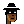
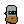
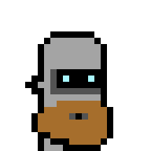
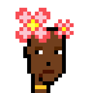
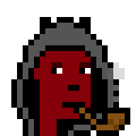
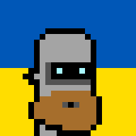
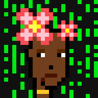
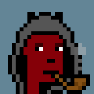

---

Looking for Matt & John's® 10 000 punks collection (Anno 2017)?
See [**Punks - The Free White Label Quick Starter Edition »**](https://github.com/cryptopunksnotdead/punks.whitelabel)


---


New to Ordinal Punks? For some background see [**Awesome 100 Ordinal Punks (Anno 2023) Notes - 24×24 Pixel Art on the (Bitcoin) Blockchain »**](https://github.com/cryptopunksnotdead/cryptopunks/tree/master/awesome-ordinalpunks)


# 100 Ordinal Punks - The Free White Label Quick Starter Edition

Yes, you can. Let's (re)create from zero / scratch a pixel-perfect
copy of the Ordinal Punks collection (Anno 2021) using text prompts ("attributes").


---

Note / Disclaimer:  I (Gerald Bauer) am the creator of the punk's not dead text-to-image generation algorithm  (& [punk spritesheet](https://github.com/cryptopunksnotdead/punks.spritesheet)) BUT
have heard about Ordinal Punks in the news and
I have no insight knowledge and
I am NOT affiliated with Ordinal Punks (HODLing: 0).

---


Let's get the official metadata (text-prompt attributes)
from [Inscription @ #58665](https://ordinals.com/inscription/d026ac5994f698dba475681359b6c29d6d39a895484b95e06b7ae49921d80df2i0) uploaded by [Tropo Farmer](https://twitter.com/tropoFarmer/status/1624528735700385792) (on February 11th, 2023).


For your convenience I have reformated
the dataset in javascript notation (.json)
into the tabular dataset in the comma-separated values (.csv) format.


The [**ordinalpunks.csv**](ordinalpunks.csv) dataset (with 100 records / rows) reads:

``` csv
id,  type,  gender, skin_tone,  count, accessories
1,  Robot,   Male,,       1,  Big Beard
2,  Human,   Male,    2,  2,  Bubble Gum / Birthday Hat
3,  Human,   Female,  1,  3,  Flowers / Frown / Gold Chain
4,  Demon,   Male,,       2,  Hoodie / Pipe
5,  Ape,     Male, Blue,  2,  Buck Teeth / Cowboy Hat
6,  Human,   Male,    3,  2,  Laser Eyes / Cowboy Hat B & W
7,  Human,   Male,    1,  1,  Cap Burger King
8,  Vampire, Male,,       1,  Demon Horns
9,  Human,   Female,  Orange,  1,  Crown
...
```


Triva / Errata:   While preparing this step-by-step guide / tutorial
if found two bugs / errors in the official metadata:

-  Ordinal Punk #25  - Incl. An Extra Hoodie
    >     "attributes": [{"trait_type": "Type",   "value": "Male 2"},
    >                    {"trait_type": "Hair",   "value": "Sombrero"},
    >                    {"trait_type": "Mouth",  "value": "Mustache"},
    >                    {"trait_type": "Clothes","value": "Hoodie"}]
-  Ordinal Punk #84  - The (Punk) Type Reads:  Alien Male Green BUT is really (Human) Male 1
    >     "attributes": [{"trait_type": "Type", "value": "Male Alien Green"},
    >                    {"trait_type": "Eyes", "value": "Eye Mask"},
    >                    {"trait_type": "Mouth","value": "Chinstrap"},
    >                    {"trait_type": "Hair", "value": "Fedora Black & White"}]


##  Method №1  -  Using The "Classic" Punk Command-Line Tool


The Official Ordinal Punks website
points / links via "using an open source algorithm to generate the profile pictures (pfps)"  to the [punk's not dead command-line tool](https://github.com/cryptopunksnotdead/cryptopunks/tree/master/cryptopunks).

Let's try to generate some punks on the command-line in your terminal
using official text-to-image prompts / attributes.


Once you have install the punk's not dead command-line tool package
try:

```
$ punk -h
```

resulting in:


resulting in:

```
NAME
    punk - punk (or cryptopunk) command line tool

SYNOPSIS
    punk [global options] command [command options] [arguments...]

VERSION
    3.0.0

GLOBAL OPTIONS
    -d, --dir,
    -o, --out, --outdir=DIR - Output directory (default: .)
    -f, --file=FILE         - All-in-one
                              composite image (default: ./punks.png)
    --offset=NUM            - Start counting at offset (default: 0)
    --seed=NUM              - Seed for random number generation /
                              shuffle (default: 4142)
    -z, --zoom=ZOOM         - Zoom factor x2, x4, x8, etc. (default: 1)

    --help                  - Show this message
    --version               - Display the program version
    --verbose               - (Debug) Show debug messages


COMMANDS
    g, gen, generate - Generate punk characters from text attributes (from
                       scratch / zero) via builtin punk spritesheet
    l, ls, list      - List all punk archetype and attribute names from builtin
                       punk spritesheet
    q, query         - Query (builtin off-chain) punk contract for punk text
                       attributes by IDs - use 0 to 9999
    t, tile          - Get punk characters via image tiles from all-in-one punk
                       series composite (./punks.png) - for IDs use 0 to 9999
    f, flip          - Flip (vertically) all punk characters in all-in-one punk
                       series composite (./punks.png)
    s, shuffle       - Shuffle all punk characters (randomly) in all-in-one
                       punk series composite (./punks.png)

    help             - Shows a list of commands or help for one command
```


No worries. We are only interested in the g/gen/generate command.
Let's generate Ordinal Punk No. 1. Type:


```
$ punk --offset=1  gen  robot_male  big_beard
```

resulting in:

```
==> generating  >robot_male + big_beard<...
 lookup 24x24 >robotmale< => 69: Robot / Archetype - Robot (m+l)
 lookup 24x24 >bigbeard_(m+l)< => 387: Big Beard / Attribute (m+l)
    saving punk #1 to >./punk-0001.png<...
```



Let's regenerate with a zoom factor of 8x (8 times 24 = 192)
to get the "original" inscribed size.
Type:


```
$ punk --offset=1 --zoom=8 gen  robot_male  big_beard
```

resulting in:

```
==> generating  >robot_male + big_beard<...
 lookup 24x24 >robotmale< => 69: Robot / Archetype - Robot (m+l)
 lookup 24x24 >bigbeard_(m+l)< => 387: Big Beard / Attribute (m+l)
    setting zoom to 8x
    saving punk #1 to >./punk-0001@8x.png<...
```




Voila!

Note:  The text-to-image generator uses space-separated
text prompts, that is,   change  "Male 2"  to `male_2` (or `male2`)
and "Bubble Gum" to `bubble_gum` (or `bubblegum`) and so on.
Let's try some more:

```
$ punk --offset=2 --zoom=8 gen  male_2  bubble_gum  birthday_hat
$ punk --offset=3 --zoom=8 gen  female_1  flowers  frown  gold_chain
$ punk --offset=4 --zoom=8 gen  demon_male  hoodie  pipe
$ punk --offset=5 --zoom=8 gen  ape_male_blue  buck_teeth  cowboy_hat
```

resulting in:






And so on.    Wondering what "magic" text-prompts / attributes
you can use?  Sorry, no artificial intelligence (a.i.) model
in use :-(  - you can lookup the "hard-coded" names
in the official punk spritesheet name list -
see [spritesheet.csv](https://github.com/cryptopunksnotdead/punks.spritesheet/blob/master/spritesheet.csv).


Tip of the Day - Did you know?
The punk text-to-image generator is part of the
[**Factory of Modern Originals (FoMO)**](https://github.com/profilepic/originals).

Let's retry with - bonus! - different backgrounds added in:

```
$ fab --name=punk1 --zoom=8 --background=ukraine  punk  robot_male  big_beard
$ fab --name=punk2 --zoom=8 --background=pride    punk  male_2  bubble_gum  birthday_hat
$ fab --name=punk3 --zoom=8 --background=matrix1  punk  female_1  flowers  frown  gold_chain
$ fab --name=punk4 --zoom=8 --background=0x638596 punk  demon_male  hoodie  pipe
$ fab --name=punk5 --zoom=8 --background=0xffbf00 punk  ape_male_blue  buck_teeth  cowboy_hat
```

resulting in:

```
==> welcome to the fab(ricate) tool:
 lookup 24x24 >robotmale< => 69: Robot / Archetype - Robot (m+l)
 lookup 24x24 >bigbeard_(m+l)< => 387: Big Beard / Attribute (m+l)
    saving original punk (192x192) to >./punk1@8x.png<...
 lookup 24x24 >male2< => 6: Human 2 / Archetype - Human (m+l)
 lookup 24x24 >bubblegum_(u+l)< => 376: Bubble Gum / Attribute (u+l)
 lookup 24x24 >birthdayhat_(u+l)< => 434: Birthday Hat / Attribute (u+l)
    saving original punk (192x192) to >./punk2@8x.png<...
 ...
```







And so on.


##  Method №2  -  Using The Punk Image Script


## Questions? Comments?

Post them on the [D.I.Y. Punk (Pixel) Art reddit](https://old.reddit.com/r/DIYPunkArt). Thanks.
