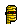
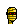
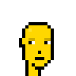
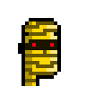
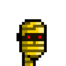

# punk maker

punkmaker gem - make your own (pixel) punk base (archetype) heads incl. humans, zombies, apes, aliens, mummies, robots, and much more


* home  :: [github.com/cryptopunksnotdead/cryptopunks](https://github.com/cryptopunksnotdead/cryptopunks)
* bugs  :: [github.com/cryptopunksnotdead/cryptopunks/issues](https://github.com/cryptopunksnotdead/cryptopunks/issues)
* gem   :: [rubygems.org/gems/punkmaker](https://rubygems.org/gems/punkmaker)
* rdoc  :: [rubydoc.info/gems/punkmaker](http://rubydoc.info/gems/punkmaker)


## Usage

Let's make golden punks...

``` ruby
require 'punkmaker'

GOLD  =  '#ffd700'

###
# humans
punk_m = Punk::Human.make( GOLD,  gender: 'm' )
punk_m.save( 'human-male_gold.png' )
punk_m.zoom(4).save( 'human-male_gold@4x.png' )

punk_f = Punk::Human.make( GOLD, gender: 'f' )
punk_f.save( 'human-female_gold.png' )
punk_f.zoom(4).save( 'human-female_gold@4x.png' )

###
# mummies
punk_m = Punk::Mummy.make( GOLD, gender: 'm' )
punk_m.save( 'mummy-male_gold.png' )
punk_m.zoom(4).save( 'mummy-male_gold@4x.png' )

punk_f = Punk::Mummy.make( GOLD, gender: 'f' )
punk_f.save( 'mummy-female_gold.png' )
punk_f.zoom(4).save( 'mummy-female_gold@4x.png' )
```


Voila!





4x








## License

The scripts are dedicated to the public domain.
Use it as you please with no restrictions whatsoever.


## Questions? Comments?

Post them over at the [Help & Support](https://github.com/geraldb/help) page. Thanks.


