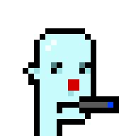
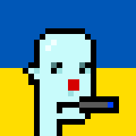
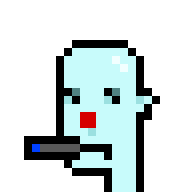

# Synth(etic) Punks  - (Free Unlimited) 24×24 Pixel Punks For Everyone


synthpunks - (free unlimited) 24×24 pixel punks for everyone - yes, you can - generate / claim your own synth(etic) punks ("off-blockchain") for your own (ethereum) account 40-hexdigit addresses e.g. 0x054f3b6eadc9631ccd60246054fdb0fcfe99b322; incl. 2x/4x/8x zoom for bigger sizes


* home  :: [github.com/cryptopunksnotdead/cryptopunks](https://github.com/cryptopunksnotdead/cryptopunks)
* bugs  :: [github.com/cryptopunksnotdead/cryptopunks/issues](https://github.com/cryptopunksnotdead/cryptopunks/issues)
* gem   :: [rubygems.org/gems/synthpunks](https://rubygems.org/gems/synthpunks)
* rdoc  :: [rubydoc.info/gems/synthpunks](http://rubydoc.info/gems/synthpunks)


##  Background - What are "On-Chain" Synthetic (Crypto) Punks V1?

> Fully on-chain (crypto) punks for every ethereum address. Check yours out for free!
>
>  -- [**syntheticpunks.com**](https://syntheticpunks.com)


[Stephan Cilliers](https://github.com/stephancill) (from South Africa)
has put together an open-source blockchain service ( - see [**stephancill/synthetic-punks**](https://github.com/stephancill/synthetic-punks) - )
to generate for free¹ 24×24 punk pixel heads for every ethereum address (account).

¹: and optionally clain / mint a (non-fungible) token for a 0.02 ether fee.


The F.A.Q. reads:

> Q: What are Synthetic Punks?
>
> A: Synthetic Punks is inspired by the historical
> collection of 10 000  Matt & John's® Punks [Anno 2017]
> by Larva Labs and Synthetic Loot by Dom Hofmann.
> It generates a unique, fully on-blockchain punk for each Ethereum address.
>
> They are free to view for any address, but can be claimed [minted]
> as an ERC-721 non-fungible token (NFT)
> for a price of 0.02 ether.
>
> Features - Each Synthetic Punk
> - Is generated from assets stored fully on-blockchain
> - Is uniquely associated with an ethereum wallet address
> - Supports Ethereum Name Service (ENS) in its metadata


## "Off-Chain" Usage In Your Script


Anyways, the synthpunks gem / library is inspired by Synthetic Punks V1
by Stephan Cilliers (see above)
and lets you generate punks using the "original"
Synthetic Punks V1 pseudo-random number and image generation formula
"off-blockchain"¹
using the "original" Synthetic Punks V1 spritesheet


and attribute categories (ranges) and names.


Let's try
the (ethereum) address 0x054f3b6eadc9631ccd60246054fdb0fcfe99b322:


``` ruby
require 'synthpunks'

punk = Synthpunks::Image.generate('0x054f3b6eadc9631ccd60246054fdb0fcfe99b322' )
punk.save( 'punk1.png' )
punk.zoom(8).save( 'punk1@8x.png' )
```

resulting in:

  8x



Tip:  Use `Synthpunks.getTokenID( addr )`
to get the "official" token id
from the address (that really is only a "convenience" helper that converts the 40-digit / 20-byte hexstring to a decimal (big) integer number). Example:

``` ruby
Synthpunks.getTokenID('0x054f3b6eadc9631ccd60246054fdb0fcfe99b322' )
#=> 30311890011735557186986086868537068337617285922

# note: yes, Synthpunks.getTokenID same as String#to_i(16)
'0x054f3b6eadc9631ccd60246054fdb0fcfe99b322'.to_i( 16 )
#=> 30311890011735557186986086868537068337617285922
```

And use the new exclusive "off-chain" only `Synthpunks.getAssetNames( id )`
helper
to get all (random) punk attributes by name.

``` ruby
Synthpunks.getAttributeNames( 30311890011735557186986086868537068337617285922 )
#=> ["Alien", "Clown Nose", "Frown", "Vape", "Eyebrows"]
```


Now look up the minted
Synthetic (Crypto) Punks V1 on the open sea (secondary)
market:

[Minted Synthetic Punk for 0x054f3b6eadc9631ccd60246054fdb0fcfe99b322
with Token ID #30311890011735557186986086868537068337617285922 @ Open Sea](https://opensea.io/assets/ethereum/0xaf9ce4b327a3b690abea6f78eccbfefffbea9fdf/30311890011735557186986086868537068337617285922)

Or see
[Synthetic Punk for 0x054f3b6eadc9631ccd60246054fdb0fcfe99b322](https://syntheticpunks.com/#/address/0x054f3b6eadc9631ccd60246054fdb0fcfe99b322)


And spot the differencence - hint: none other
than the "dark / black-ish" background is missing.


Let's retry  and let's add the "dark / black-ish" background
that is, #1A1A1A,  using the rgb hex color code:

``` ruby
punk = Synthpunks::Image.generate('0x054f3b6eadc9631ccd60246054fdb0fcfe99b322' )
punk = punk.background( '#1A1A1A' )
punk.save( 'punk1b.png' )
punk.zoom(8).save( 'punk1b@8x.png' )
```

resulting in:

  8x


Or for fun let's try some more new "custom" backgrounds.
Example:  Stand with Ukraine / Ukraine Flag:

``` ruby
punk = Synthpunks::Image.generate('0x054f3b6eadc9631ccd60246054fdb0fcfe99b322' )
punk = punk.background( 'ukraine' )
punk.save( 'punk1c.png' )
punk.zoom(8).save( 'punk1c@8x.png' )
```

resulting in:

  8x



or

``` ruby
punk = punk.background( 'rainbow' )
```

resulting in:

  8x


and so on.

Tip:  Looking for left-looking phunks?  Try `Image#mirror`.
Example:

``` ruby
punk = Synthpunks::Image.generate('0x054f3b6eadc9631ccd60246054fdb0fcfe99b322' )
phunk = punk.mirror
phunk.save( 'phunk1.png' )
phunk.zoom(8).save( 'phunk1@8x.png' )
```

resulting in:

  8x



Bonus Tip:  Derive your own custom default profile pictures
using `Image#silhouette`. Example:


``` ruby
punk = Synthpunks::Image.generate('0x054f3b6eadc9631ccd60246054fdb0fcfe99b322' )
punk = punk.silhouette( '0x647785' ).background( '0xCCD5DE' )
punk.save( 'punk1-default1.png' )
punk.zoom(8).save( 'punk1-default1@8x.png' )
```

resulting in:

  8x


or is blue the new gray?

``` ruby
punk = punk.silhouette( '0x4474E0' ).background( '0xA0C2FF' )
```

resulting in:

  8x


and so on.


Yes, you can.
Let's try some more
(ethereum) addresses.

``` ruby
punk = Synthpunks::Image.generate( '0x7a80ee32044f496a7bfef65af738fdda3a02cf02' )
punk.save( "punk2.png" )
punk.zoom(8).save( "punk2@8x.png" )
```

resulting in:

  8x


and the attributes

``` ruby
tokenID = Synthpunks.getTokenID( '0x7a80ee32044f496a7bfef65af738fdda3a02cf02' )
#=> 699372119169819039191610289391678040975564001026
Synthpunks.getAttributeNames( tokenID )
#=> ["Human 1", "Rosy Cheeks", "Shadow Beard", "Wild Hair", "VR"]
```

and compare with the "original" with the attributes:
- Human 1
- Rosy Cheeks
- Wild Hair
- VR
- Shadow Beard


[Minted Synthetic Punk for 0x7a80Ee32044F496A7bFeF65Af738FddA3a02CF02
with Token ID #699372119169819039191610289391678040975564001026 @ Open Sea](https://opensea.io/assets/ethereum/0xaf9ce4b327a3b690abea6f78eccbfefffbea9fdf/699372119169819039191610289391678040975564001026)

Or see [Synthetic Punk for 0x7a80Ee32044F496A7bFeF65Af738FddA3a02CF02](https://syntheticpunks.com/#/address/0x7a80Ee32044F496A7bFeF65Af738FddA3a02CF02)

and so on.


¹:  Yes, the (on-chain) solidity  contract code
got translated "by-hand" to (off-chain) ruby script.

Example -  the entropy pseudo-random number generator source:

``` solidity
function randomUint(uint256 seed, uint256 offset) public view returns (uint256)
{
    require(offset < 32, "Offset out of bounds");
    bytes32 entropy = keccak256(abi.encodePacked(address(this), seed));
    bytes32 mask = bytes32(0xff << (offset * 8));
    uint256 out = uint256((entropy & mask) >> (offset * 8));
    return out;
}
```

and the matching ruby version:

``` ruby
ADDRESS = '0xaf9CE4B327A3b690ABEA6F78eCCBfeFFfbEa9FDf'

## note:
##   returns a random unit number between 0-255 (0-ff)
##     use offset (0-31),that is, byte out of byte32 entropy buffer/hash

def randomUint( seed, offset )
  # assert( offset < 32, "Offset out of bounds")
  entropy = keccak256( hex_to_bin( ADDRESS ) +
                       hex_to_bin( uint256_to_hex(seed)) )

  ##  note: pick a uint/byte (shorter version)
  bytes = entropy.bytes.reverse
  bytes[offset]
end
```


## License

The scripts are dedicated to the public domain.
Use it as you please with no restrictions whatsoever.


## Questions? Comments?

Post them on the [D.I.Y. Punk (Pixel) Art reddit](https://old.reddit.com/r/DIYPunkArt). Thanks.
